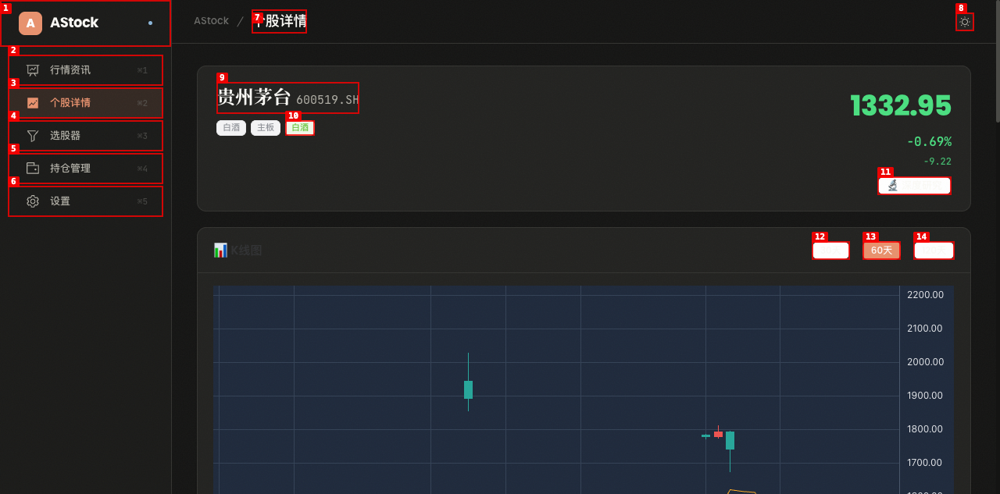
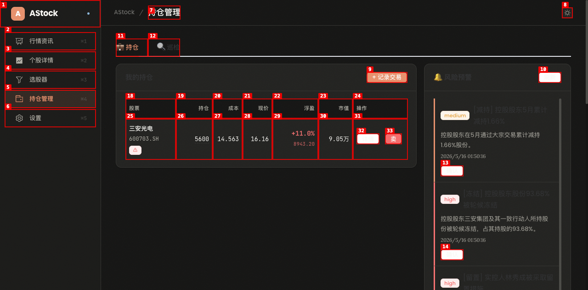
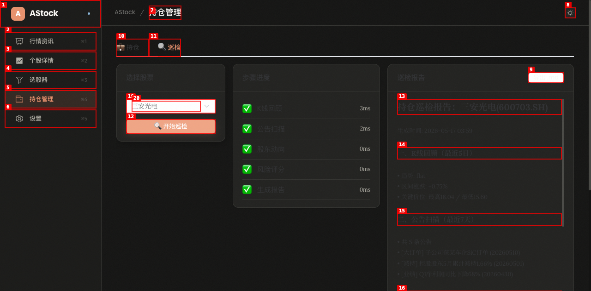
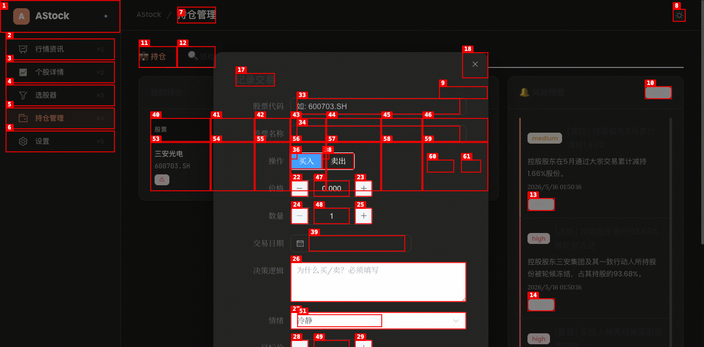
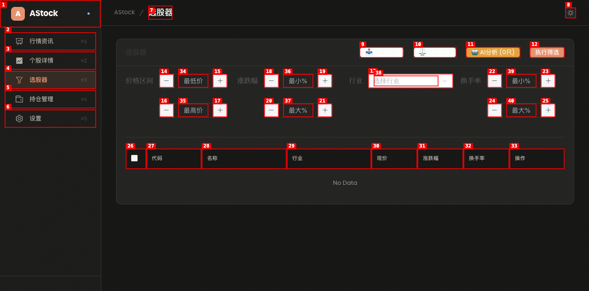
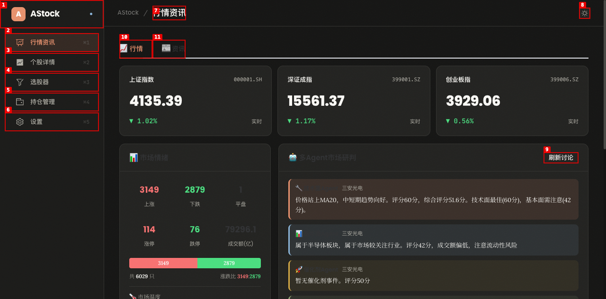
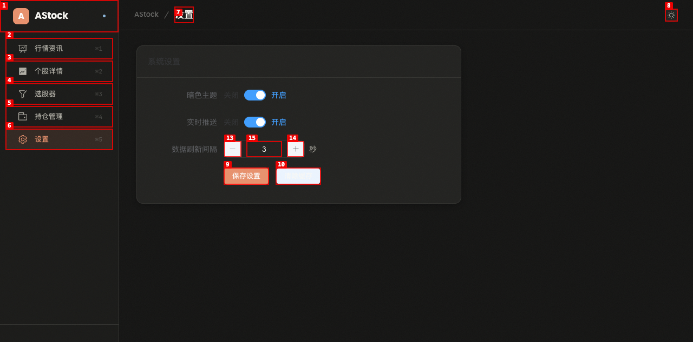

# Dogfood Report: Stock Analyzer (Astock)

| Field | Value |
|-------|-------|
| **Date** | 2026-05-17 |
| **App URL** | http://localhost:5173 |
| **Session** | stock-analyzer |
| **Scope** | Full app |

## Summary

| Severity | Count |
|----------|-------|
| Critical | 0 |
| High | 0 |
| Medium | 5 |
| Low | 7 |
| **Total** | **12** |

## Issues

### ISSUE-001: "交易检查清单"按钮点击无响应

| Field | Value |
|-------|-------|
| **Severity** | medium |
| **Category** | functional |
| **URL** | http://localhost:5173/stock/600519.SH |
| **Repro Video** | N/A |

**Description**

在个股详情页面，点击"📝 交易检查清单"按钮后没有任何反应。没有弹出对话框、没有导航跳转、也没有任何提示信息。用户无法使用此功能。

**Repro Steps**

1. 导航到个股详情页面，选择一只股票（如贵州茅台）
   

2. 点击"📝 交易检查清单"按钮
   

3. **观察：** 页面无任何变化，按钮点击无效
   

---

### ISSUE-002: "加入自选"按钮点击后无视觉反馈

| Field | Value |
|-------|-------|
| **Severity** | medium |
| **Category** | ux |
| **URL** | http://localhost:5173/stock/600519.SH |
| **Repro Video** | N/A |

**Description**

在个股详情页面，点击"⭐ 加入自选"按钮后，按钮文字和状态没有任何变化。用户无法确认操作是否成功执行。预期行为：按钮应变为"已加入自选"或显示成功提示。

**Repro Steps**

1. 导航到个股详情页面，选择一只股票
   

2. 点击"⭐ 加入自选"按钮
   

3. **观察：** 按钮文字仍为"⭐ 加入自选"，无任何状态变化或提示
   

---

### ISSUE-003: 风险预警严重程度标签显示原始英文文本

| Field | Value |
|-------|-------|
| **Severity** | medium |
| **Category** | visual |
| **URL** | http://localhost:5173/portfolio |
| **Repro Video** | N/A |

**Description**

持仓管理页面的风险预警区域，严重程度标签直接显示原始英文文本"medium"和"high"，而非中文标签（如"中风险"、"高风险"）或样式化的标签组件。这破坏了中文界面的一致性。

**Repro Steps**

1. 导航到持仓管理页面
   

2. **观察：** 风险预警列表中，每条预警前显示原始英文"medium"或"high"文本
   

---

### ISSUE-004: 巡检报告中多处英文未翻译

| Field | Value |
|-------|-------|
| **Severity** | medium |
| **Category** | content |
| **URL** | http://localhost:5173/portfolio |
| **Repro Video** | N/A |

**Description**

持仓巡检报告中存在多处英文文本未翻译为中文：
- 趋势描述显示"flat"（应为"横盘"或"震荡"）
- 风险等级显示"HIGH"（应为"高"）
- 步骤耗时显示不真实（"3ms"、"0ms"），可能是缓存结果导致

**Repro Steps**

1. 导航到持仓管理 → 巡检标签
2. 选择"三安光电"并点击"开始巡检"
3. 等待巡检完成
   

4. **观察：** 报告中趋势显示"flat"、风险等级显示"HIGH"、步骤耗时显示"3ms"等不真实数据
   

---

### ISSUE-005: 交易记录表单无验证

| Field | Value |
|-------|-------|
| **Severity** | medium |
| **Category** | functional |
| **URL** | http://localhost:5173/portfolio |
| **Repro Video** | N/A |

**Description**

持仓管理页面的"记录交易"对话框，提交空表单时没有任何验证提示。股票代码、股票名称为空，价格为0时仍可点击"确认"按钮。预期行为：必填字段应有验证提示，价格和数量应有合理范围限制。

**Repro Steps**

1. 导航到持仓管理页面
2. 点击"+ 记录交易"按钮
   

3. 不填写任何内容，直接点击"确认"
   

4. **观察：** 表单没有任何验证提示，虽然对话框未关闭但也没有错误信息
   

---

### ISSUE-006: "No Data"空状态文本为英文

| Field | Value |
|-------|-------|
| **Severity** | low |
| **Category** | content |
| **URL** | http://localhost:5173/screener |
| **Repro Video** | N/A |

**Description**

选股器页面和巡检历史记录表格的空状态显示英文"No Data"，与全中文界面不一致。应显示为"暂无数据"。

**Repro Steps**

1. 导航到选股器页面，未执行筛选时
   

2. **观察：** 表格空状态显示英文"No Data"
   

---

### ISSUE-007: 事件日期格式不规范

| Field | Value |
|-------|-------|
| **Severity** | low |
| **Category** | content |
| **URL** | http://localhost:5173/portfolio |
| **Repro Video** | N/A |

**Description**

持仓事件时间线和巡检报告中的日期显示为"20260510"格式，而非更易读的"2026-05-10"格式。这种紧凑格式不利于用户快速识别日期。

**Repro Steps**

1. 导航到持仓管理页面
2. 查看持仓事件时间线区域
   

---

### ISSUE-008: "成分股"标签切换无效果

| Field | Value |
|-------|-------|
| **Severity** | low |
| **Category** | functional |
| **URL** | http://localhost:5173/ |
| **Repro Video** | N/A |

**Description**

在行情资讯页面的领涨板块区域，点击"成分股"按钮后数据没有变化，仍然显示行业板块排名。预期行为：切换到"成分股"标签后应显示个股排名而非行业排名。

**Repro Steps**

1. 导航到行情资讯页面
2. 在领涨板块区域点击"行业"按钮（默认选中）
3. 点击"成分股"按钮
   

4. **观察：** 数据没有变化，仍显示行业排名
   

---

### ISSUE-009: 交易记录"标签"下拉框显示英文"Select"

| Field | Value |
|-------|-------|
| **Severity** | low |
| **Category** | content |
| **URL** | http://localhost:5173/portfolio |
| **Repro Video** | N/A |

**Description**

记录交易对话框中的"标签"下拉框默认占位文本显示英文"Select"，与中文界面不一致。应显示为"请选择"。

**Repro Steps**

1. 导航到持仓管理页面
2. 点击"+ 记录交易"按钮
   

---

### ISSUE-010: "清除缓存"无确认对话框

| Field | Value |
|-------|-------|
| **Severity** | low |
| **Category** | ux |
| **URL** | http://localhost:5173/settings |
| **Repro Video** | N/A |

**Description**

设置页面的"清除缓存"按钮是破坏性操作，但点击后没有确认对话框直接执行。用户可能误点导致数据丢失。预期行为：应弹出确认对话框。

**Repro Steps**

1. 导航到设置页面
2. 点击"清除缓存"按钮
   

3. **观察：** 直接执行，无确认对话框
   

---

### ISSUE-011: 强支撑和弱支撑值相同

| Field | Value |
|-------|-------|
| **Severity** | low |
| **Category** | content |
| **URL** | http://localhost:5173/stock/600519.SH |
| **Repro Video** | N/A |

**Description**

个股详情页面的支撑压力位区域，贵州茅台的"强支撑"和"弱支撑"值完全相同（均为1327.11），这在逻辑上不合理。强支撑应低于弱支撑。

**Repro Steps**

1. 导航到个股详情页面，选择贵州茅台
2. 滚动到支撑压力位区域
   

---

### ISSUE-012: 控制台Element Plus弃用警告和调试日志

| Field | Value |
|-------|-------|
| **Severity** | low |
| **Category** | console |
| **URL** | http://localhost:5173/portfolio |
| **Repro Video** | N/A |

**Description**

控制台存在以下问题：
1. Element Plus弃用警告：`[el-radio] [API] label act as value is about to be deprecated` - 应使用value属性替代label
2. 调试日志泄露：`[useStockDetail] code changed to: undefined` 等console.log在生产环境中不应出现
3. `[useStockDetail] code changed to: undefined` 在每次导航到个股详情页时都会触发

**Repro Steps**

1. 打开浏览器开发者工具控制台
2. 导航到个股详情页面
3. **观察：** 控制台输出调试日志和Element Plus弃用警告
