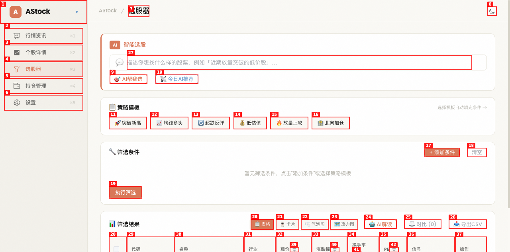
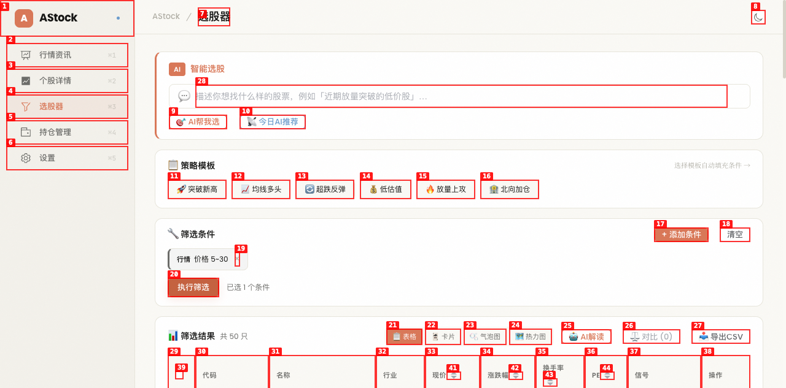
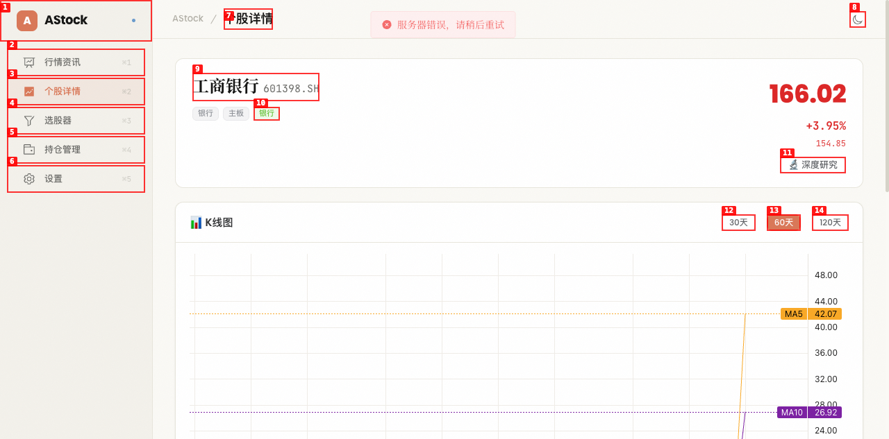
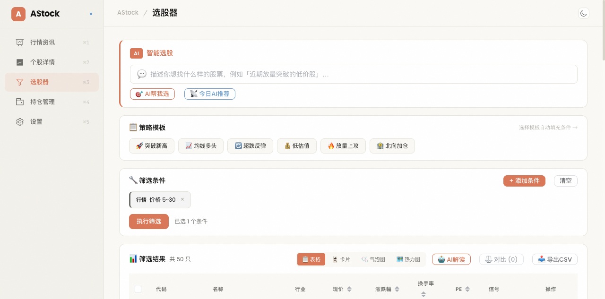
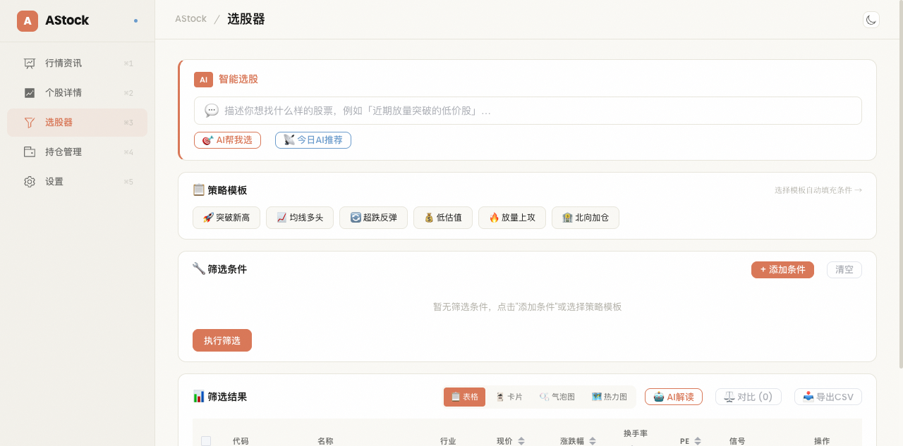
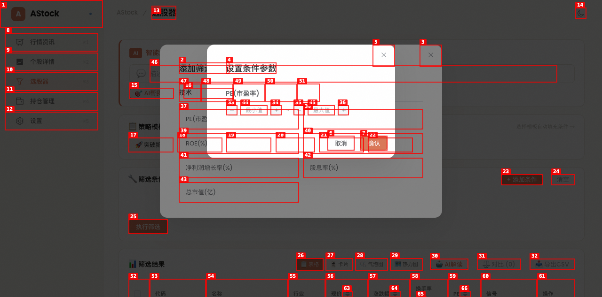
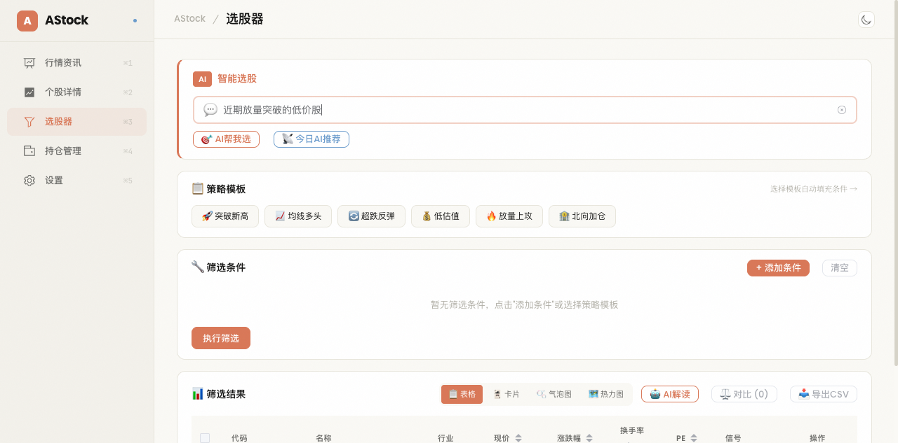
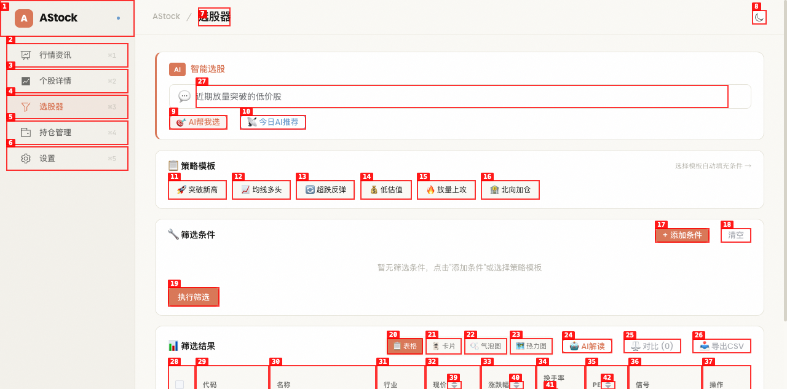
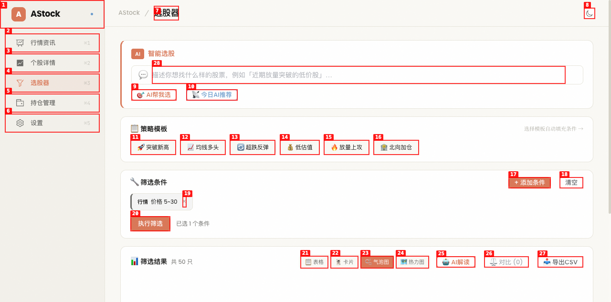
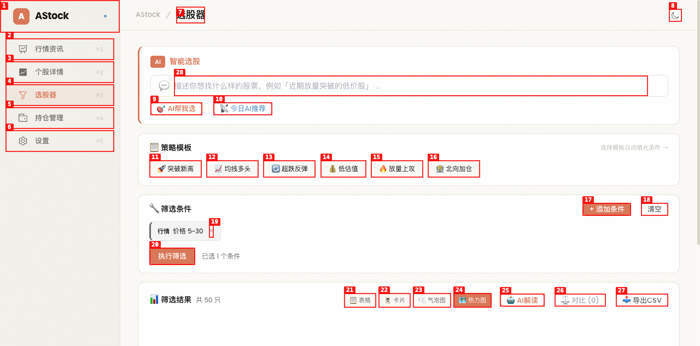

# Dogfood Report: Stock Analyzer - 选股器深度测试

| Field | Value |
|-------|-------|
| **Date** | 2026-05-17 |
| **App URL** | http://localhost:5173/screener |
| **Session** | screener-deep-test |
| **Scope** | 选股器全功能深度测试 |

## Summary

| Severity | Count |
|----------|-------|
| Critical | 0 |
| High | 2 |
| Medium | 5 |
| Low | 3 |
| **Total** | **10** |

## Issues

### ISSUE-001: 信号列显示原始英文key而非中文标签

| Field | Value |
|-------|-------|
| **Severity** | high |
| **Category** | content |
| **URL** | http://localhost:5173/screener |
| **Repro Video** | videos/strategy-template-test.webm |

**Description**

筛选结果表格的"信号"列中，部分信号显示原始英文key（如 `drop_20d_low`、`ma_bearish`、`volume_shrink`、`consolidation`），而非中文标签。例如：
- `drop_20d_low` 应显示为"跌破20日新低"
- `ma_bearish` 应显示为"均线空头"
- `volume_shrink` 应显示为"缩量"
- `consolidation` 应显示为"缩量盘整"

而部分信号已正确翻译（如"连涨"、"RSI超卖"），说明 `SIGNAL_LABELS` 映射表不完整，缺少多个信号的中文翻译。

**Repro Steps**

1. 导航到选股器页面
   

2. 添加行情→价格条件(5~30)，执行筛选
   

3. **观察：** 信号列中"平安银行"显示 `drop_20d_low`，"万科A"显示 `ma_bearish`，"民生银行"显示 `consolidation volume_shrink`，"中兴通讯"显示"连涨 volume_shrink"
   

---

### ISSUE-002: 换手率列大部分显示为"%"无数值

| Field | Value |
|-------|-------|
| **Severity** | high |
| **Category** | content |
| **URL** | http://localhost:5173/screener |
| **Repro Video** | N/A |

**Description**

筛选结果表格中，"换手率"列大部分行只显示"%"符号，没有数值。50条结果中仅"平安银行"正确显示了"0.50%"，其余49条均只显示"%"。这表明后端返回的 `turnover_rate` 字段大部分为 null/undefined，前端模板 `row.turnover_rate?.toFixed(2)` 在值为 undefined 时输出空字符串，只留下后缀的"%"。

**Repro Steps**

1. 导航到选股器页面
2. 添加行情→价格条件(5~30)，执行筛选
   

3. **观察：** 换手率列大部分只显示"%"，无实际数值
   

---

### ISSUE-003: 筛选条件和结果在页面导航后丢失

| Field | Value |
|-------|-------|
| **Severity** | medium |
| **Category** | ux |
| **URL** | http://localhost:5173/screener |
| **Repro Video** | N/A |

**Description**

用户在选股器页面设置筛选条件并执行筛选后，如果点击结果中的"查看"按钮跳转到个股详情页面，再通过导航栏返回选股器页面，之前的筛选条件和结果全部丢失。用户需要重新设置条件和执行筛选，这在实际使用中非常不便。

预期行为：筛选条件和结果应通过 Pinia store 持久化或 URL 参数保持，导航返回后应恢复之前的状态。

**Repro Steps**

1. 导航到选股器页面
2. 添加条件并执行筛选，确认有结果
3. 点击某只股票的"查看"按钮，跳转到个股详情
   

4. 点击导航栏"选股器"返回
5. **观察：** 筛选条件已清空，结果表格显示"暂无数据"
   

---

### ISSUE-004: "突破新高"策略模板点击后不填充条件

| Field | Value |
|-------|-------|
| **Severity** | medium |
| **Category** | functional |
| **URL** | http://localhost:5173/screener |
| **Repro Video** | videos/strategy-template-test.webm |

**Description**

点击"🚀 突破新高"策略模板后，筛选条件区域没有任何变化，仍显示"暂无筛选条件"。而点击"📈 均线多头"模板则正常填充了2个条件（均线多头排列、MACD金叉）。这可能是后端返回的"突破新高"模板的 conditions 为空数组，或前端 applyTemplate 逻辑有问题。

**Repro Steps**

1. 导航到选股器页面
   

2. 点击"🚀 突破新高"策略模板
   

3. **观察：** 条件区域仍显示"暂无筛选条件"，"清空"按钮仍为禁用状态
   

---

### ISSUE-005: 参数输入对话框无验证，可确认空值

| Field | Value |
|-------|-------|
| **Severity** | medium |
| **Category** | functional |
| **URL** | http://localhost:5173/screener |
| **Repro Video** | N/A |

**Description**

在"设置条件参数"对话框中，用户可以不填写任何值直接点击"确认"按钮。此时会添加一个 min/max 均为 undefined 的范围条件，条件标签显示为"PE(市盈率) ~"（空值范围），这是无意义的条件。预期行为：应验证至少填写一个值，否则禁用确认按钮或显示验证提示。

**Repro Steps**

1. 导航到选股器页面
2. 点击"+ 添加条件"
3. 切换到"基本"标签，点击"PE(市盈率)"
   

4. 不填写任何值，直接点击"确认"
5. **观察：** 条件被添加，显示"基本 PE(市盈率) ~"，这是无效的范围条件

---

### ISSUE-006: AI帮我选返回空结果时无用户反馈

| Field | Value |
|-------|-------|
| **Severity** | medium |
| **Category** | ux |
| **URL** | http://localhost:5173/screener |
| **Repro Video** | videos/ai-input-test.webm |

**Description**

在AI智能选股输入框中输入"近期放量突破的低价股"并点击"🎯 AI帮我选"后，API返回了匹配关键词（突破、放量、低价）但 stocks 为空数组。此时页面没有任何反馈——没有提示"未找到匹配股票"，也没有自动将匹配的关键词转化为筛选条件。用户不知道AI是否工作了。

预期行为：当AI选股返回空结果时，应显示友好提示（如"未找到符合条件的股票，已识别到以下关键词：突破、放量、低价"），或自动将关键词转为筛选条件让用户进一步调整。

**Repro Steps**

1. 导航到选股器页面
2. 在AI输入框中输入"近期放量突破的低价股"
   

3. 点击"🎯 AI帮我选"
4. 等待请求完成
5. **观察：** 页面无任何变化，无成功/失败提示，条件区域仍为空
   

---

### ISSUE-007: AI输入框回车触发的是AI解析而非AI选股

| Field | Value |
|-------|-------|
| **Severity** | medium |
| **Category** | ux |
| **URL** | http://localhost:5173/screener |
| **Repro Video** | N/A |

**Description**

AI智能选股输入框按回车键触发的是 `handleParse`（AI解析，将自然语言转为筛选条件），而不是 `handlePick`（AI帮我选，直接返回股票列表）。从用户角度看，输入"近期放量突破的低价股"后按回车，期望的是直接得到选股结果，而不是只解析出条件还需要再点"执行筛选"。

这两个功能的区别对用户不够清晰。建议：回车应触发最常用的操作（AI选股），或在输入框旁明确提示回车是"解析条件"而非"直接选股"。

**Repro Steps**

1. 导航到选股器页面
2. 在AI输入框中输入查询文本
3. 按回车键
4. **观察：** 触发的是AI解析（只生成条件），而非AI选股（直接返回结果）

---

### ISSUE-008: 气泡图和热力图视图为占位符但无视觉区分

| Field | Value |
|-------|-------|
| **Severity** | low |
| **Category** | ux |
| **URL** | http://localhost:5173/screener |
| **Repro Video** | N/A |

**Description**

视图切换器中有4个选项（表格、卡片、气泡图、热力图），但气泡图和热力图都是未开发的占位符，点击后只显示"开发中，敬请期待"。这些未完成的功能在视图切换器中没有视觉区分（如灰色、禁用态、beta标签），用户可能误以为功能已上线。

建议：对未开发的功能添加禁用样式或"即将推出"标签，避免用户困惑。

**Repro Steps**

1. 导航到选股器页面，执行筛选获取结果
2. 点击"🫧 气泡图"视图
   

3. **观察：** 显示"气泡图视图开发中，敬请期待"占位符，但切换按钮无任何区分
4. 点击"🗺️ 热力图"视图
   

5. **观察：** 同样显示占位符

---

### ISSUE-009: 策略模板点击后不自动执行筛选

| Field | Value |
|-------|-------|
| **Severity** | low |
| **Category** | ux |
| **URL** | http://localhost:5173/screener |
| **Repro Video** | N/A |

**Description**

点击策略模板（如"均线多头"）后，条件被填充到筛选条件区域，但不会自动执行筛选。用户需要再手动点击"执行筛选"按钮。从用户角度看，选择策略模板的意图就是想看到对应结果，自动执行筛选更符合预期。

建议：点击策略模板后自动执行筛选，或在填充条件后显示一个明显的"执行筛选"提示。

**Repro Steps**

1. 导航到选股器页面
2. 点击"📈 均线多头"策略模板
3. **观察：** 条件已填充（均线多头排列、MACD金叉），但结果仍为空，需手动点击"执行筛选"

---

### ISSUE-010: 条件参数输入对话框两个弹窗叠加

| Field | Value |
|-------|-------|
| **Severity** | low |
| **Category** | visual |
| **URL** | http://localhost:5173/screener |
| **Repro Video** | N/A |

**Description**

点击"+ 添加条件"按钮打开条件选择器对话框后，选择一个范围条件（如PE），会弹出"设置条件参数"对话框。此时页面上同时存在两个对话框叠加：底层的"添加筛选条件"和上层的"设置条件参数"。虽然功能上可以工作，但视觉上两个弹窗叠加显得混乱，且关闭参数对话框后仍需手动关闭条件选择器。

建议：选择范围条件时，在同一个对话框内切换到参数输入视图，而非叠加新弹窗。

**Repro Steps**

1. 导航到选股器页面
2. 点击"+ 添加条件"
3. 切换到"基本"标签，点击"PE(市盈率)"
   

4. **观察：** 两个对话框叠加显示，底层是"添加筛选条件"，上层是"设置条件参数"

---

## 使用意见总结

### 整体评价

选股器的功能架构设计合理，涵盖了AI智能选股、策略模板、条件构建器、多视图展示、AI解读等核心功能，覆盖了从"不知道怎么选"到"精确筛选"的完整使用场景。UI风格统一，暗色主题下的视觉层次清晰。

### 核心优势

1. **AI智能选股**：自然语言输入→条件解析/直接选股的双模式设计很实用，降低了使用门槛
2. **策略模板**：6个预设模板覆盖了常见选股策略，一键填充条件很方便
3. **条件构建器**：5大类（技术/基本/形态/资金/行情）条件分类清晰，参数输入支持范围和布尔两种模式
4. **多视图切换**：表格/卡片两种视图满足不同浏览需求
5. **AI解读和对比**：筛选后的AI深度分析和多股对比功能是差异化亮点

### 主要改进建议

1. **数据完整性**（高优先级）：换手率大面积缺失、信号翻译不完整是最影响使用体验的问题。用户看到"%"无数字或"drop_20d_low"英文key，会直接质疑数据可靠性
2. **状态持久化**（高优先级）：导航离开再返回丢失所有状态，这在实际选股流程中非常常见（看到好股票→查看详情→回来继续筛选），必须解决
3. **AI反馈优化**（中优先级）：AI选股返回空结果时需要友好提示，AI解析和AI选股的区分需要更清晰
4. **交互细节**（低优先级）：模板自动执行筛选、参数验证、弹窗叠加等小问题
